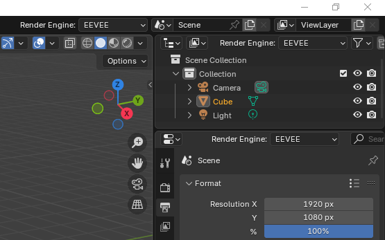
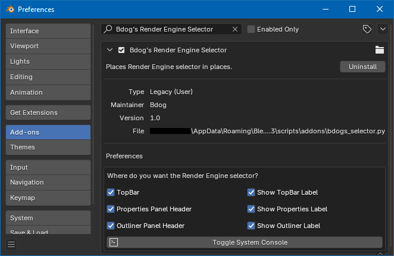

# BDOG'S RENDER ENGINE SELECTOR

Thanks for checking out this fun, retro and useful addon!

This allows you to restore the render engine selector to Blender's TopBar, which is great for old school users as well as instructors who want their students to easily see the currently enabled render engine. You can also place the selector in the Properties and Outliner panel headers.

Settings are customizeable and you have the ability to display one or multiple selectors along with the ability to show or hide the "Render Engine" text label.

Version 2.8 was one of the most important Blender releases and it represented a huge step forward. But, it was not without growing pains. One such pain was the removal of the render engine selector from the TopBar. Although, it found a new home hidden in the Properties panel. Now, you can unhide it! :-)

In the spirit of progress, I personally recommend enabling the render engine selector in the Properties panel _header_ and disabling it in other locations. This helps to reinforce the muscle memory of going to the Properties panel, which is where the selector is currently buried. But, it adds the convenience of instant visibility and accessibility without having to switch to the Render tab.

**REQUIREMENTS:**

This addon was developed for Blender 2.93 LTS. It hasn't been updated to support more recent versions. Hence, caveat emptor. That said, it seems to work fine with newer versions including 3.6 LTS and 4.5 LTS. ***USE AT YOUR OWN RISK.*** 
 
**LIMITATIONS:**

Render engine selector in the Properties>Render tab cannot be hidden.

In the Outliner, the selector is only displayed in "View Layer" display mode. It does not display in any of the other display modes (i.e Scenes, Blender File, Video Sequencer, etc...). However, additional development could add it to those modes, as well.

**HOW TO INSTALL:**

Save "bdogs_selector.py" to your desktop. Then, open Blender and go to "Settings>Add-ons". In older versions of Blender, you can simply click "Install" and install the file you saved to your desktop . In newer Blender versions, click the chevron arrow pulldown menu in the upper right corner of the Add-ons panel and choose "Install from disk". Then, install the file from your desktop.

**ORIGINAL SOURCE CODE:**

This addon was derived from Blender 2.93 whose original Python source code is included as part of the Blender application install. The full application source code is also available on GitHub.

**Application Installer:**

https://download.blender.org/release/Blender2.93/

**Full Source Code:**

https://github.com/blender/blender